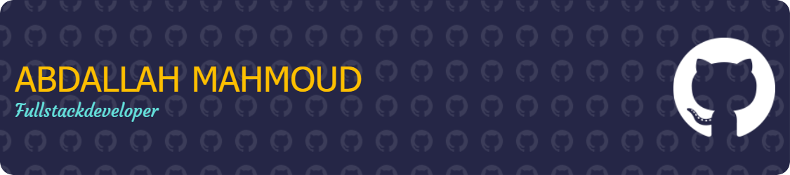

  
  

## Hey, I'm Mohammed 👋

I'm a Backend Developer focused on building maintainable web applications, integrations, and APIs with **PHP** and **Laravel**. I enjoy turning complicated business requirements into simple, reliable software.

- 🔭 Currently building backend systems and payment integrations
- 🧩 Interested in clean architecture, APIs, queues, and performance
- 🛠️ I like shipping practical solutions with readable code
- 📍 Open to interesting backend collaborations

## Tech stack

## Featured work

## GitHub activity

 

## Contribution animation

### Thanks for stopping by — let's build something useful 🚀

